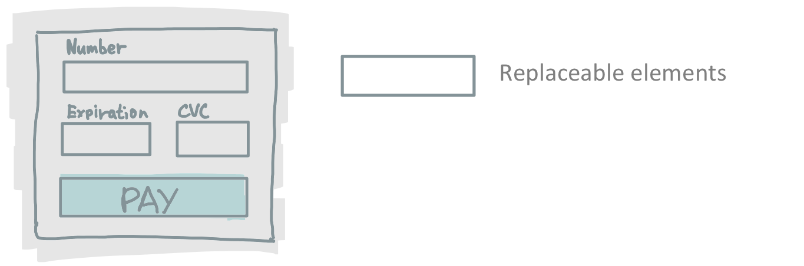

# Secure Inputs

**This is a POC! I made it for my startup [PowerPayments](https://powerpayments.io). You should never use it in production. The document follows "working backwards" approach (kind of) so, do not take it seriously and don't believe everything you read here. Still, you can check source code, see how it works inside and take any part you need for your work.**

## Introduction

As a payment service provider you may want to give your customers the ability to fully customize their checkout page and reduce the burden of PCI compliance? Some payment companies already do this:  [Elements](https://stripe.com/payments/elements) from Stripe, [Hosted Fields](https://developers.braintreepayments.com/start/hosted-fields) from Braintree, Spreedly [iFrame Payment Form](https://docs.spreedly.com/guides/adding-payment-methods/iframe/). **Secure-inputs** is a set of UI components that your customers can use to accept credit cards on their website while having full control of the style of their checkout UI.

## Problem

Companies dealing with cardholder data (store, process or transmit) must be inline with PCI Data Security Standard requirements.

E-commerce merchant must assess security of cardholder data using self-assessment questionnaire (PCI SAQ). There are different types of SAQs. They vary by number of questions and required compliance effort. It's in the interest of payment service provider to reduce the amount of work merchant have to do and at the same time provide maximum flexibility for creating custom checkout forms.

There is a SAQ-A for merchants that have fully outsourced all cardholder data functions to PCI DSS compliant third-party service providers. This SAQ is relatively easy to complete. But what does it mean "fully outsourced all cardholder data functions"? Here are the important points:

1. all processing of cardholder data is entirely outsourced to PCI DSS validated third-party service providers;
2. merchant does not electronically store, process, or transmit any cardholder data on merchant systems or premises, but relies entirely on a third party(s) to handle all these functions;
3. merchant has confirmed that all third party handling storage, processing, and/or transmission of cardholder data are PCI DSS compliant;
4. all elements of the payment page delivered to the consumer’s browser originate only and directly from a PCI DSS validated third-party service provider.

Points 1-2 are usually solved with sending data directly to the 3rd party service provider via redirects, AJAX/XHR requests, etc. Point 3 is a paperwork. **Secure-input** solves the most complex point 4.

## Solution

**Secure-inputs** replaces checkout form elements on the merchant website with elements that are hosted by you (PCI DSS compliant payment service provider). Thus, merchants may use SAQ-A for self-assessment and have full control of the look and feel of their payment flow.

## How it works

Everything starts from a checkout page. Merchant creates payment form with the desired design and uses placeholders for cardholder data elements (card number, cvc, expiration date).



Html code of the form with replaceable elements (ids: number, exp and cvc):

```html
<div class="container">
    <div class="row">
                <div class="col-md-6 mb-3">
                    <h3>Credit Card form</h3>
                    <label>Name on card</label>
                    <input class="form-control" id="cc-name" placeholder="" required="" type="text">
                    <small class="text-muted">Full name as displayed on card</small>
                    <div class="invalid-feedback">
                        Name on card is required
                    </div>

                </div>
            </div>
            <div class="row">
                <div class="col-md-6 mb-3">
                    <div id="number" class="form-control"></div>
                    <div class="invalid-feedback">
                        Card number is not valid
                    </div>
                </div>
            </div>
            <div class="row">
                <div class="col-md-6 mb-3">
                    <label for="cc-email">Email</label>
                    <input class="form-control" id="cc-email" placeholder="" required="" type="email">
                    <small class="text-muted">Email</small>
                    <div class="invalid-feedback">
                        Email is required
                    </div>

                </div>
            </div>
            <div class="row">
                <div class="col-md-3 mb-3">
                    <label>Expiration</label>
                    <div id="exp" class="form-control"></div>
                    <div class="invalid-feedback">
                        Expiration date required
                    </div>
                </div>
                <div class="col-md-3 mb-3">
                    <label>CVV</label>
                    <div id="cvc" class="form-control"></div>
                    <div class="invalid-feedback">
                        Security code required
                    </div>
                </div>
            </div>
</div>
```

Merchant loads SDK with the following line of code:

```javascript
<script type="text/javascript" src="https://secure-input.herokuapp.com/power-payments.js"></script>
```

Then he initializes payment form fields and do customization:

```javascript
var style = {
    base: {
        fontSize: '1em',
        color: '#514d4d',
        fontFamily: "'Open Sans', sans-serif",
        fontWeight: '400',
        lineHeight: '1.5',
        fontSmoothing: 'antialiased',
        ':focus': {
            fontWeight: '600'
        },
    },
    complete: {
        color: '#39a42e',
    },
    invalid: {
        color: '#e5424d',
    }
};

var power = PowerPayments('PUBLIC_API_KEY_GOES_HERE';
var elements = power.elements();
var card = elements.create('number', { placeholder: 'Card number', style: style }).mount('#number');
var cvc = elements.create('cvc', { placeholder: 'CVC', style: style }).mount('#cvc');
var exp = elements.create('exp', { placeholder: 'MM / YY', style: style }).mount('#exp');

var btnPay = document.getElementById('pay');

btnPay.addEventListener('click', function() {
    elements.createToken().then(function(token) {
        // do something with received card token
        //resultEl.innerHTML = JSON.stringify(result, null, 2);
        console.log(token);
    });
});

// listen to a change event for element
card.addEventListener('change', function(event) {
    // event.isInvalid - there was a validation error for element
    // event.complete - element is valid and data input is complete
    var feedbackEl = document.getElementById('number').nextElementSibling;
    var iconEl = feedbackEl.nextElementSibling;

    if (event.isInvalid) {
        feedbackEl.style.display = 'block';
        iconEl.classList.add("invalid");
    } else {
        feedbackEl.style.display = 'none';
        iconEl.classList.remove("invalid");
        iconEl.classList.remove("valid");

        if (event.complete === true) {
            iconEl.classList.add("valid");
        }
    }
});
```


## How to Get Started

## Backend Endpoints

## Customer Quote

# JS-SDK


## HTTPS on js.power.dev

Password for myCA.pem is **1234**

This is a how to for self signed certificates: https://deliciousbrains.com/ssl-certificate-authority-for-local-https-development/


## How to test pipeline locally

Don't forget that you need .env file with IAM user that can assume DeployerRole:

```
AWS_ACCESS_KEY_ID=XXX
AWS_SECRET_ACCESS_KEY=YYY
```

Then, to run deployment script:

> docker-compose run pipeline sh

check what we run in bitbucket-pipelines.yml step/script and reproduce here like:

> export ACCOUNT_ID=$ACCOUNT_STAGING_ID
> export AWS_DEFAULT_REGION=us-east-1
> export S3_BUCKET=cdn.powerpayments.tech
> ./scripts/s3_deploy.sh

Hello from 2019!
